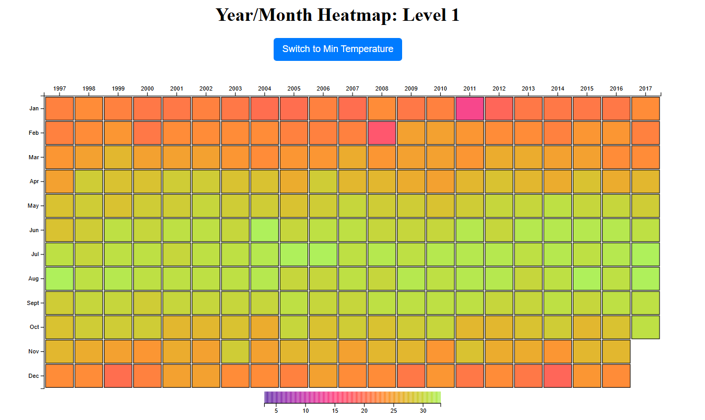

**CSCE 679: Data Visualization - Assignment 2**

This assignment contains two HTML files, `level1.html` and `level2.html`, for Levels 1 and 2, respectively.

**To view the visualizations:**

1.  Start a local Python server: Open your terminal and execute `python3 -m http.server 8000`.
2.  Open the following URLs in your web browser:
    * `http://localhost:8000/Level1.html`
    * `http://localhost:8000/Level2.html`

**Level 1**

**Level 2**

